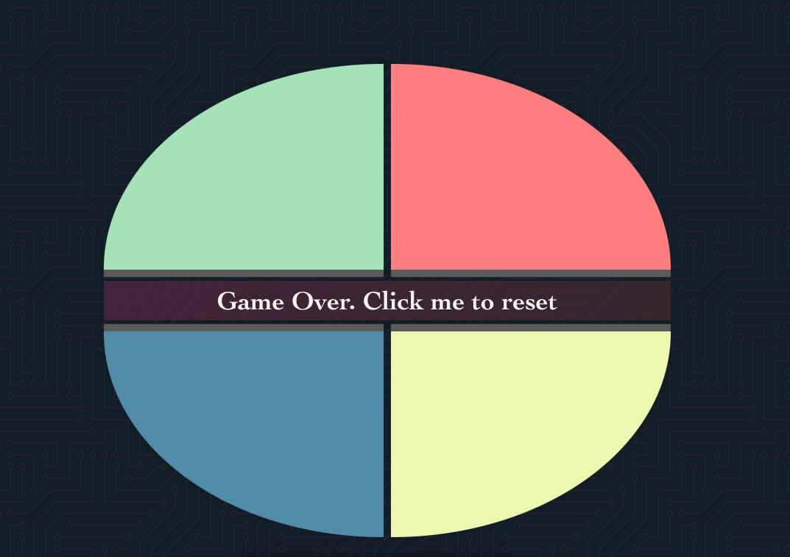

# Simon Game

#### Simon is the game can help people Train Eyes & Brain

#### Looking at the quick flash color will train your eye focus

#### Remember the sequence to train brain memory

#

# Getting Started

#### Playing game [here.](https://tuanng-simon.netlify.app/)

#### Game have 2 mode, normal is default and hard mode is more challenge

#

# Attributions

#### Font:

- [Josefin](https://fonts.google.com/specimen/Josefin+Sans?query=Josefin)

#### Social-icon:

- [fontawesome](https://fontawesome.com/)

#### Sound:

- [freesound.org](https://freesound.org/)

#### CSS:

- [CSS animation](https://www.w3schools.com/css/css3_animations.asp)

#

#

# Technologies Used

- JavaScript
- HTML
- CSS
- Git

#

# Ice boxes

- Add a rank table for the player by name
- 2 players can play together
