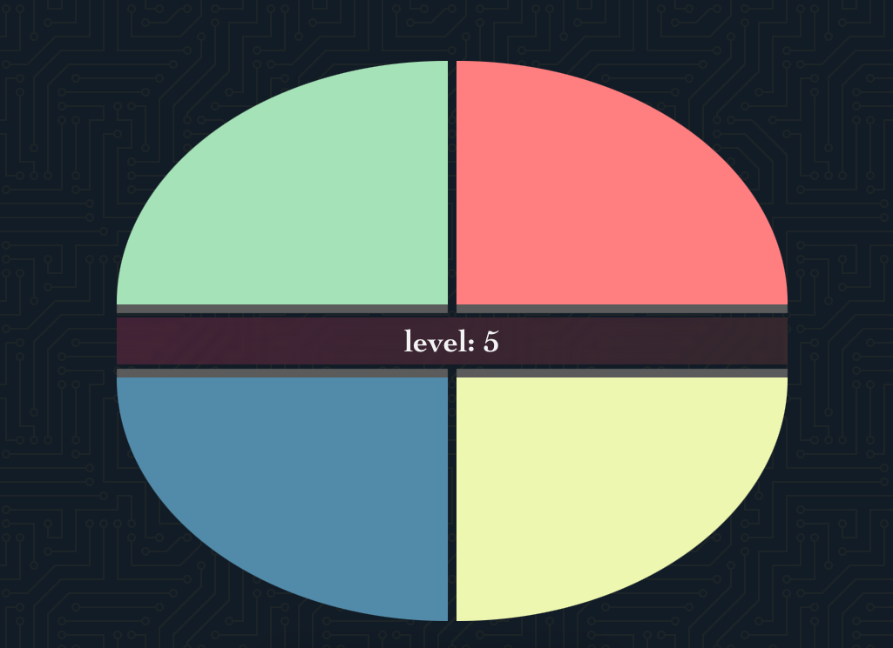

# Simon Game

### Simon is the game can help people Train Eyes & Brain

#### Looking at the quick flash color will train your eye focus

#### Remember the sequence to train brain memory

#

# Getting Started

## Playing game [here.](https://tuanng-simon.netlify.app/)

## Extra information

#### Game have 2 mode, normal is default and hard mode is more challenge

#

# Attributions

#### Font: [Josefin](https://fonts.google.com/specimen/Josefin+Sans?query=Josefin)

#### Social-icon: [fontawesome](https://fontawesome.com/)

#### Sound: [freesound.org](https://freesound.org/)

# Technologies

## JavaScript

## HTML

## CSS

# Next Steps

#### Add dark-light mode

#### Add a rank table for the player by name
